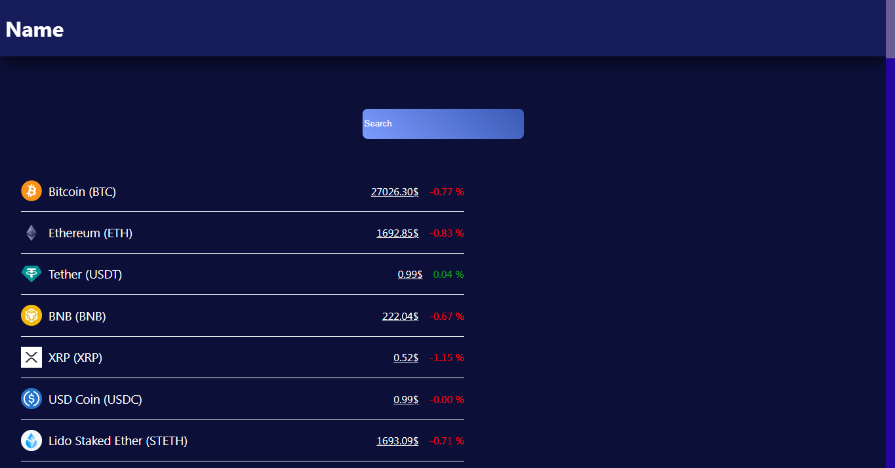

_BETA-VERSION_

<h2>Links:</h2>

<ul>
    <li><a href="https://crypto-bux.netlify.app/">CryptoBux</a></li>
    <li><a href="#how-to-use">How-To-Use</a></li>
    <li><a href="#license">License</a></li>
</ul>

[](https://app.netlify.com/sites/crypto-bux/deploys)

<h1 style="text-align: center;">
    <strong>
        CryptoBux
    </strong>
</h1>



<p style="font-size: 16px; text-align: center;">RateRipple - simple Web-Application based on React with API that can convert a lot of currencies in world.</p>

<h1 style="text-align: center;" id="how-to-use">
    <strong>
        How To Use:
    </strong>
</h1>

<p style="font-size: 16px;">
    Clone Repo
</p>

`git clone <repo_url>`

<p style="font-size: 16px;">
    Requirements:
</p>

<ul>
    <li>Node 16.x or Newer</li>
</ul>

<p style="font-size: 16px;">
    Setup:
</p>

```
> npm i
> npm start
```

<h1 style="text-align: center; font-weight: bold;" id="license">
    License: MIT
</h1>
